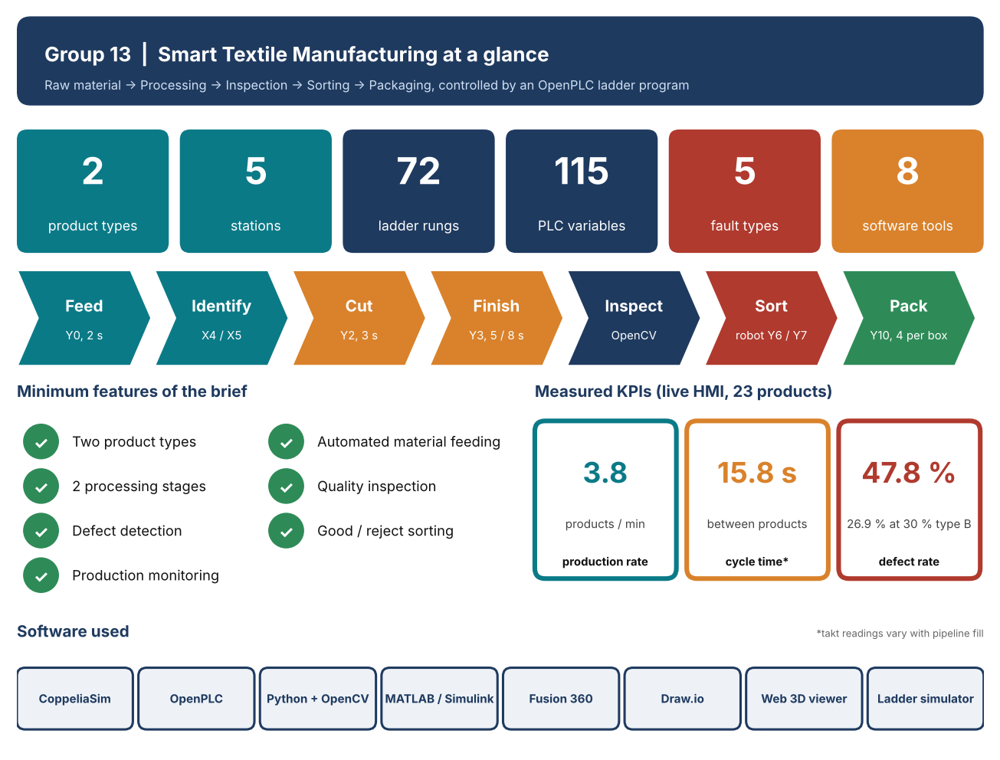
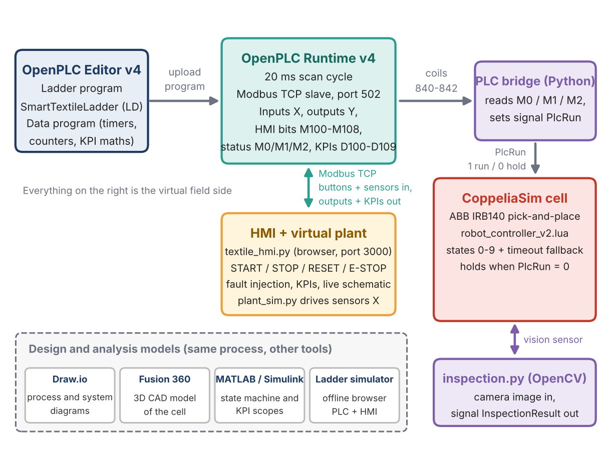
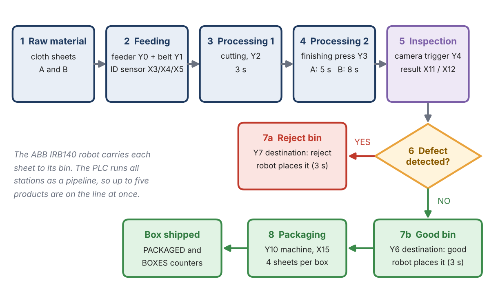
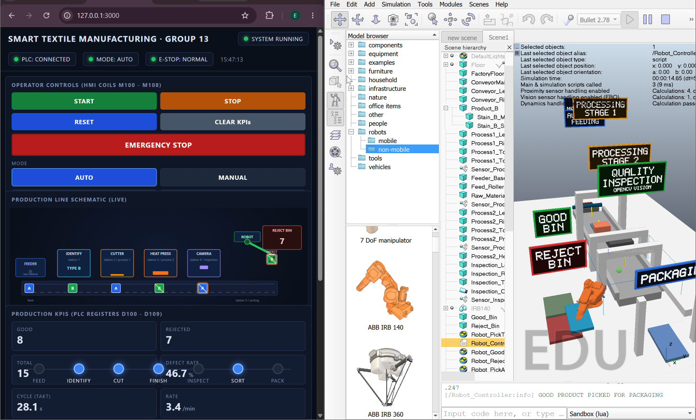
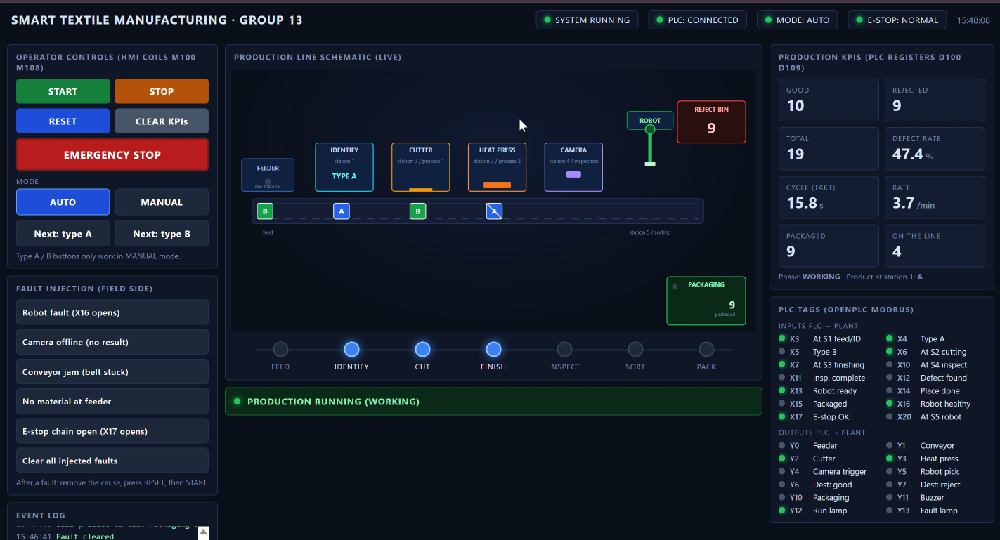
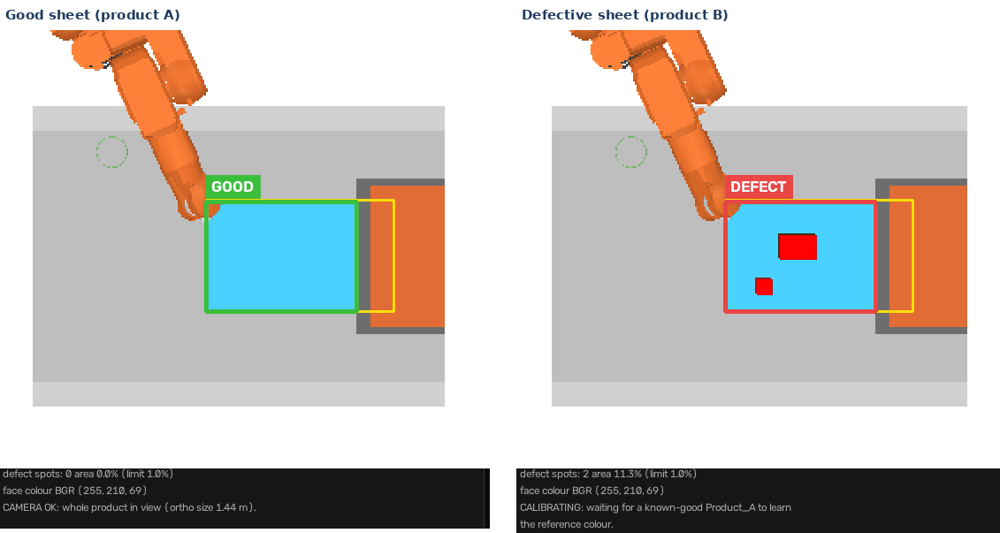
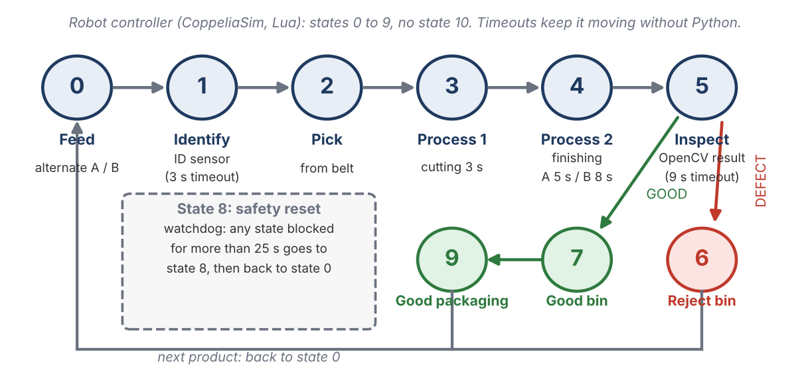
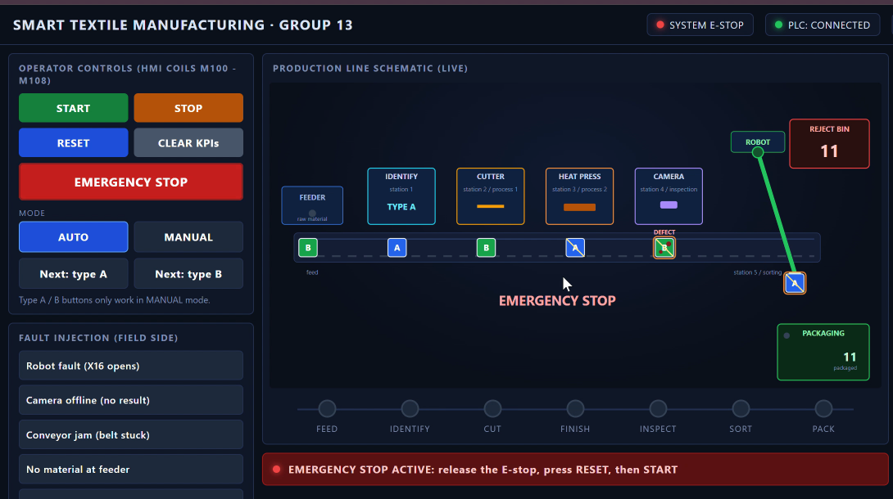
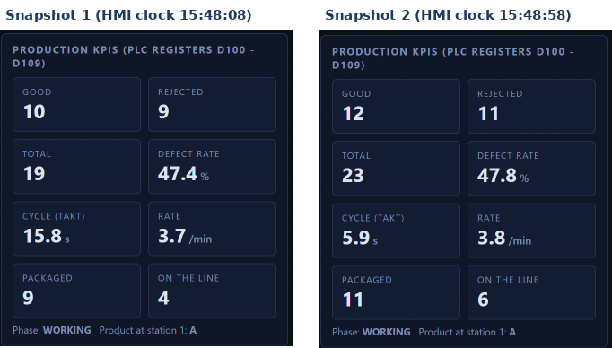

# Smart Textile Manufacturing

**A simulated textile production line, controlled by a real PLC program.**
Raw material → Processing → Inspection → Sorting → Packaging, with an OpenPLC ladder program as the brain, a CoppeliaSim 3D cell as the body, OpenCV as the eyes and a live browser HMI as the control room.


Individual project for the *Robotics & Automation* simulation challenge, Symbiosis Institute of Technology, Pune.



---

## Contents

1. [The idea in one picture](#the-idea-in-one-picture)
2. [Features](#features)
3. [Architecture](#architecture)
4. [Process flow](#process-flow)
5. [Screenshots](#screenshots)
6. [Repository layout](#repository-layout)
7. [Quick start](#quick-start)
8. [PLC details and Modbus map](#plc-details-and-modbus-map)
9. [Robot controller](#robot-controller)
10. [Vision inspection](#vision-inspection)
11. [Faults, safety and recovery](#faults-safety-and-recovery)
12. [KPIs and results](#kpis-and-results)
13. [Limitations and future work](#limitations-and-future-work)
14. [Documentation](#documentation)
15. [Author](#author)
16. [License](#license)

---

## The idea in one picture

Think of a real factory with four layers, each one simulated:

| Layer | What it is | Implemented as |
|---|---|---|
| **The brain** | Decides what every machine does | OpenPLC Runtime running a 72-rung ladder program |
| **The body** | The machines: conveyor, cutter, press, camera and robot | 3D factory in CoppeliaSim with an ABB IRB 140 robot |
| **The eyes** | Looks at each product and judges its quality | OpenCV program (stain area against a 1.0 % limit) |
| **The control room** | Operator presses START or STOP and watches the numbers | Browser HMI served by a small Python web server |

All four talk to each other over **Modbus TCP**, the standard language of industrial machines.

## Features

Every minimum feature of the brief is covered.

| Requirement | My solution |
|---|---|
| Two product types | **A** (denim, 5 s finish) and **B** (cotton, 8 s finish, carries stains), told apart by sensors X4 / X5 |
| Automated material feeding | Feeder `Y0` and conveyor `Y1`, no operator involved |
| At least two processing stages | Cutter `Y2` (3 s) and heat press `Y3` (5 s or 8 s) |
| Quality inspection and defect detection | Camera trigger `Y4`, OpenCV measures stain area, limit 1.0 % |
| Good / reject sorting | ABB IRB 140 places each sheet into the good (`Y6`) or reject (`Y7`) bin |
| Production monitoring | Browser HMI with live schematic, PLC tags, KPIs and event log |
| KPIs | Production rate, cycle (takt) time and defect percentage, calculated inside the PLC |

Beyond the minimum:

- A **pipelined five-station indexing line**: five products are on the line at once.
- **Five fault types** with alarm, fault code and a safe recovery path, plus **fault injection from the HMI**.
- A **vision fallback**: if OpenCV gives no answer within 9 s, the robot uses the product type, so the line never blocks.
- Two extra tools: an **offline ladder simulator** (one HTML file) and a **MATLAB / Simulink** model of the same line.

## Architecture


Everything runs on one computer and talks through **localhost**.

1. The operator presses a button on the HMI page. The Python HMI server turns it into a 0.3 s pulse on an HMI coil in the PLC (a pulse is long enough for the 20 ms PLC scan to see it).
2. The HMI server also plays the plant for the PLC: every 20 ms it reads the PLC outputs, advances the plant model and writes the sensor inputs back.
3. OpenPLC runs the ladder program and sets the run, fault and E-stop status bits.
4. The bridge reads those bits every 0.1 s and sets the CoppeliaSim signal `PlcRun`. When it is 0 the robot controller freezes the whole 3D cell. If the PLC link is lost, the bridge also sets it to 0, so the cell fails safe.
5. OpenCV reads the camera image from CoppeliaSim and returns `InspectionResult` (0 good, 1 defect) to the robot controller.

> **Note.** The HMI counters come from the virtual plant. The 3D cell and the vision program each keep their own counters, so numbers and speed can differ between them.



## Process flow



| Station | Time | What happens |
|---|---|---|
| S1 Feed and identify | about 2.5 s | Feeder `Y0` loads a sheet. Sensors `X4` (A) or `X5` (B) set the product type |
| S2 Processing 1: cut | 3 s | Cutter `Y2` trims the sheet |
| S3 Processing 2: finish | 5 s (A) or 8 s (B) | Heat press `Y3` |
| S4 Inspect | about 1.2 s | Camera trigger `Y4`, OpenCV returns good or defect, 5 s timeout |
| S5 Robot sorting | about 3 s | IRB 140 picks (`Y5`) and places into `Y6` good or `Y7` reject |
| Packaging | 4 good sheets per box | Packaging machine `Y10`, done signal `X15` |

When every station has finished, the conveyor indexes once and all products advance together. The longest path per cycle (cut 3 s + finish 8 s + sort 3 s) means the robot sets the throughput.

## Screenshots

**HMI (left) and the CoppeliaSim cell (right), running together**



**Operator HMI connected to the OpenPLC Runtime**



**OpenCV inspection: a good sheet (left) and a defective sheet (right)**



## Repository layout

```
smart-textile-manufacturing/
├── plc/                              OpenPLC program
│   ├── SmartTextile_Ladder_plcopen.xml   ladder program (import into OpenPLC Editor)
│   ├── SmartTextile_plcopen.xml          same program as one Structured Text program
│   ├── SmartTextile.st                   Structured Text source
│   └── Ladder_rung_map.md                    rung number to flag name map
├── hmi/                              Browser HMI and virtual plant
│   ├── textile_hmi.py                        web server (port 3000) + Modbus link to the PLC
│   ├── plant_sim.py                          plant model: conveyor, sensors, cutter, press, robot, packing
│   └── plc_probe.py                          small tool to check what the PLC sees
├── coppeliasim/                      3D cell
│   ├── Scene1.ttt                            CoppeliaSim scene
│   ├── robot_controller_v2.lua               robot state machine (states 0 to 9)
│   └── coppelia_plc_bridge.py                PLC to CoppeliaSim link (signal PlcRun)
├── vision/
│   ├── inspection.py                         OpenCV inspection: camera in, GOOD / DEFECT out
│   └── camera_setup.py                       one-off helper: sets the camera view size from the scene geometry
├── simulation/
│   ├── plc_ladder_hmi_sim.html               offline ladder simulator (open in a browser)
│   └── matlab/                               MATLAB animation and Simulink model builder
├── cad/SmartTextile_Cell.step        3D CAD model of the cell (Fusion 360 export)
├── docs/                             report (PDF), diagrams (draw.io) and images
└── requirements.txt
```

## Quick start

**You need:** OpenPLC Editor and Runtime v4, CoppeliaSim 4.10 (the EDU version is fine) and Python 3.

```bash
pip install -r requirements.txt
```

1. **OpenPLC Runtime.** Start it, then open **OpenPLC Editor** and import `plc/SmartTextile_Ladder_plcopen.xml`. Under *Servers*, add a **Modbus server on port 502**. Connect to `127.0.0.1`, run *Clean build and upload*, and check that the console shows *PLC started* and *Upload complete*.
2. **HMI.** In a terminal:
   ```bash
   python hmi/textile_hmi.py --autostart
   ```
   Open <http://127.0.0.1:3000>. Options: `--plc-host`, `--plc-port`, `--port`, `--mix alt|A|B|rand`.
3. **CoppeliaSim.** Open `coppeliasim/Scene1.ttt`. If the `Robot_Controller` script in the scene is not the latest version, paste `coppeliasim/robot_controller_v2.lua` into it. Press **Play**. (Only if you change the camera or station positions: with the simulation *stopped*, run `python vision/camera_setup.py` once, then save the scene with Ctrl+S. It sets the `Inspection_Camera` view size so the whole product is in view.) Speed is set by `SPEED_FACTOR` at the top of the script (1.0 = original, 2.0 = twice as fast, used for the demo video).
4. **Bridge.** In a second terminal:
   ```bash
   python coppeliasim/coppelia_plc_bridge.py
   ```
5. **Press START on the HMI.** The 3D cell starts. STOP and E-STOP freeze it.
6. **Vision.** In a third terminal, with CoppeliaSim playing:
   ```bash
   python vision/inspection.py
   ```
   An *Inspection Camera - OpenCV* window opens. Keys: `q` quit, `s` snapshot, `d` debug mask, `r` reset counters. Results are written to `inspection_log/` (see [Vision inspection](#vision-inspection)).

> Do not run `plant_sim.py` as a standalone program while the HMI is running: both write the same input coils.

**No PLC at hand?** Open `simulation/plc_ladder_hmi_sim.html` in a browser. It runs the same ladder program offline, with a virtual plant, fault tests and a live ladder view.

**To watch the ladder live in OpenPLC Editor:** turn on the debugger icon for the variables you want, run *Clean build and upload*, then click the bug icon in the left toolbar. Active contacts and coils turn green.

## PLC details and Modbus map

- **Programs:** `SmartTextileLadder` (ladder, 72 rungs) and `SmartTextileData` (structured text for timers, counters and KPI maths). Together they use 115 variables.
- **I/O:** 17 digital inputs (`X0` to `X20`) and 12 digital outputs (`Y0` to `Y13`). Addresses are octal, so `X0` to `X7`, `X10` to `X17` and `X20` give 17 inputs.
- **Scan:** 20 ms. **Modbus TCP server** on port 502.

| Item | Modbus address |
|---|---|
| Outputs `Y0`–`Y13` (feeder, conveyor, cutter, heat press, camera trigger, robot pick, good / reject destination, packaging, buzzer, run lamp, fault lamp) | coils 0–11 |
| HMI buttons `M100`–`M108` (start, stop, reset, auto, manual, product A, product B, clear counters, E-stop) | coils 800–808 |
| Field inputs `X0`–`X17`, `X20` (push-buttons, station sensors, vision result, robot signals, E-stop chain) | coils 816–832 |
| Status `M0` run, `M1` fault, `M2` E-stop | coils 840, 841, 842 |
| KPI registers `D100`–`D109` (good, reject, total, defect % ×100, takt time, rate, current product, phase, fault code, packaged) | holding registers 1024–1033 |

Main timers: T0 feed 2 s · T1 cut 3 s · T2 finish A 5 s · T3 finish B 8 s · T4 inspection timeout 5 s · T7 index watchdog 15 s · T8 identification dwell 0.5 s · T9 identification timeout 3 s · T10 robot watchdog 30 s · T11 packaging watchdog 15 s.

## Robot controller

`coppeliasim/robot_controller_v2.lua` drives the ABB IRB 140 as a state machine with ten states:

| State | Meaning | State | Meaning |
|---|---|---|---|
| 0 | Feed | 5 | Inspect |
| 1 | Identify | 6 | Reject |
| 2 | Pick | 7 | Good |
| 3 | Process 1 (cut) | 8 | Safety reset |
| 4 | Process 2 (finish) | 9 | Packaging |

Three timeouts keep it from ever blocking:

- **3 s** for the identification sensor,
- **9 s** for the OpenCV answer (it then uses the product type),
- **25 s** watchdog that resets any blocked state.

The cell reads the signal `PlcRun` every cycle. With no bridge running the signal does not exist and the cell runs freely.



## Vision inspection

`vision/inspection.py` connects to CoppeliaSim through the remote API, reads the image of the `Inspection_Camera` (a vision sensor above station 4) and judges every product with classical OpenCV. There is **no trained model**: it is colour segmentation plus an area threshold.

1. **Wait for the product.** The robot controller sets the signal `InspectionActive` during state 5. Without it, the program checks whether `Product_A` / `Product_B` is within a small distance of `/Sensor_InspectionTrigger`.
2. **Find the product surface.** The expected outline of the product is projected into the image. The orange robot is masked out (HSV), the dominant colour inside the outline (in LAB colour space) is taken as the face colour, and the largest connected region of that colour is the product surface.
3. **Find anomalies.** Inside the surface, shrunk by a 12 % margin, any pixel whose colour is more than 28 LAB units away from the face colour is anomalous (stains, holes, patches). Morphology removes noise, and blobs of at least 10 px are counted as spots.
4. **Apply the defect rules** (all configurable at the top of the file):
   - **surface defect:** anomalous area is at least **1.0 %** of the product surface (and at least 20 px), or
   - **colour off-spec:** the face colour is more than 22 units away from the reference colour. The reference is learned from the first known-good `Product_A`, so the window reads *CALIBRATING* until then.
5. **Latch the verdict.** The same result must hold for 5 consecutive frames. It is then counted once per product and published as the CoppeliaSim signal `InspectionResult`: **-1 waiting, 0 good, 1 defect**.
6. **Report.** The window shows the camera with the product box (green GOOD / red DEFECT), the defect pixels in red, the pipeline strip, counters and KPIs. Vision-side KPI signals (`KPI_Good`, `KPI_Defect`, `KPI_Total`, `KPI_DefectPct`, `KPI_RatePerMin`, `KPI_CycleTime`) are also published.

Measured readings: good sheet **0 spots, 0.0 %**; defective sheet **2 spots, 11.3 %**; inspection time about 1.2 s.

**Outputs** (in `inspection_log/`, created on first run): `results.csv` (one row per product), `kpi_summary.txt`, `final_dashboard.png` and one PNG per product. Counters and KPIs restart from 0 on every Play.

OpenCV functions used include `cvtColor` (BGR to LAB and HSV), `inRange`, `dilate` / `erode` / `morphologyEx`, `connectedComponentsWithStats`, `findContours`, `convexHull` and `boundingRect`.

## Faults, safety and recovery

The HMI has fault-injection buttons (robot fault, camera offline, conveyor jam, no material, E-stop chain open) to prove each fault is handled.

| Fault | Trigger | Code (`D108`) |
|---|---|---|
| Inspection timeout | No vision result for 5 s (T4) | 1 |
| Robot fault | `X16` opens, or the robot takes more than 30 s (T10) | 2 |
| Jam / no material | No index for 15 s (T7), or packaging for 15 s (T11) | 3 |
| Unknown product | Identification fails for 3 s (T9) | 4 |
| Emergency stop | `X17` opens, or the HMI E-STOP button (`M108`) | 5 |

**Response.** A fault latches `M1` (or `M2` for an E-stop). The stop rule drops the run bit `M0`, which switches every machine output off. The fault lamp `Y13` and buzzer `Y11` turn on, and the fault code is written to `D108`.

**Recovery** takes three steps in this order: remove the cause, press **RESET** (accepted only when `X16` and `X17` are both OK), then press **START**.

`X16` and `X17` use normally-closed wiring (ON = healthy), so a broken wire is treated as a fault.



## KPIs and results

The three suggested KPIs are calculated inside the PLC (registers `D103` defect % ×100, `D104` takt in 0.1 s, `D105` rate in 0.1 per minute).

| KPI | Result |
|---|---|
| Production rate | **3.8 products per minute** (live HMI run), about one product every 16 s |
| Defect percentage | **47.8 %** at a 50 % type-B mix · **26.9 %** at a 30 % mix (offline simulator, 20× time) |
| Products in the live run | 23 processed: 12 good, 11 rejected, 11 packaged |
| Cycle (takt) time | Varies with pipeline fill; the first readings include the time to fill the line |

> The defect rate is high **by design**. Products alternate between A and B, and only B carries stains, so the rate settles near the share of B. It is a test load that keeps the reject path busy, not a quality claim about real fabric.



## Limitations and future work

- It is a simulation. Sensors, motors and the robot are modelled, and the heat press has no temperature control; it is simply switched on for a fixed time.
- The vision method is colour and area based, tuned for the stains in this scene. It is not a general fabric-defect detector.
- One robot sets the throughput.
- The OpenCV result goes to the robot controller. Feeding it into the PLC inputs `X11` / `X12` through the bridge is a planned improvement.

Ideas for next steps: a trained model (for example a CNN) for real fabric defects, real PLC hardware and I/O, a database for production logs, more stations and robots, and OPC UA for plant integration.

## Documentation

- **Diagrams (draw.io):** [`docs/SmartTextile_diagrams.drawio`](docs/SmartTextile_diagrams.drawio)
- **Rung map:** [`plc/Ladder_rung_map.md`](plc/Ladder_rung_map.md)
- **MATLAB and Simulink:** [`simulation/matlab/README_MATLAB.md`](simulation/matlab/README_MATLAB.md)

Tools used: CoppeliaSim, OpenPLC, Python with OpenCV and pymodbus, MATLAB / Simulink, Fusion 360 and draw.io.

## Author

**Eesha Masand**, Robotics & Automation, Symbiosis Institute of Technology, Pune

## License

Copyright (c) 2026 Eesha Masand. **All rights reserved.** This repository is shared for academic evaluation only. No licence is granted to copy, modify, redistribute or reuse the code or documents without the author's written permission.

This project builds on third-party tools that keep their own licences and are **not** included here: [OpenPLC](https://autonomylogic.com/) (Editor and Runtime), [CoppeliaSim](https://www.coppeliarobotics.com/) (the scene uses its ABB IRB 140 robot model and is subject to the CoppeliaSim licence terms), [OpenCV](https://opencv.org/), [pymodbus](https://github.com/pymodbus-dev/pymodbus), MATLAB / Simulink and Fusion 360.
